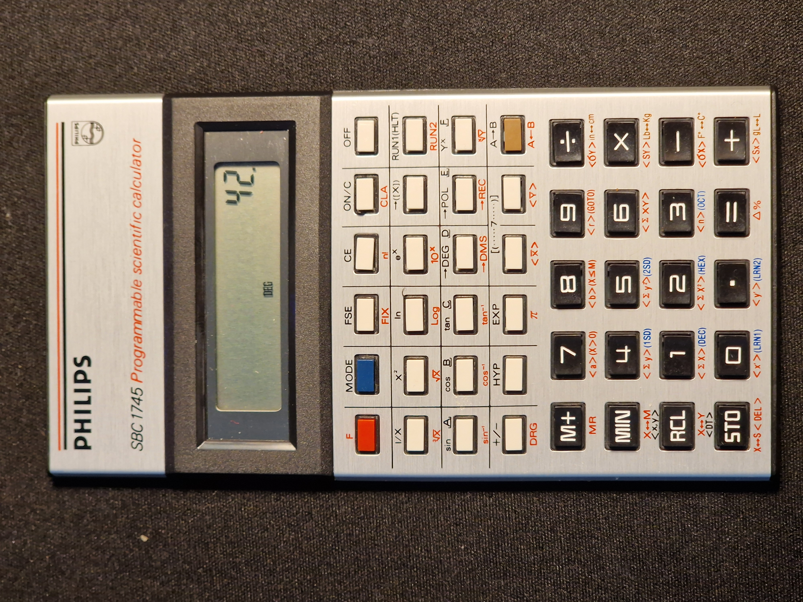
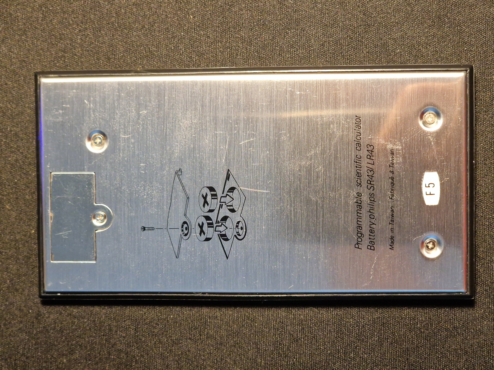
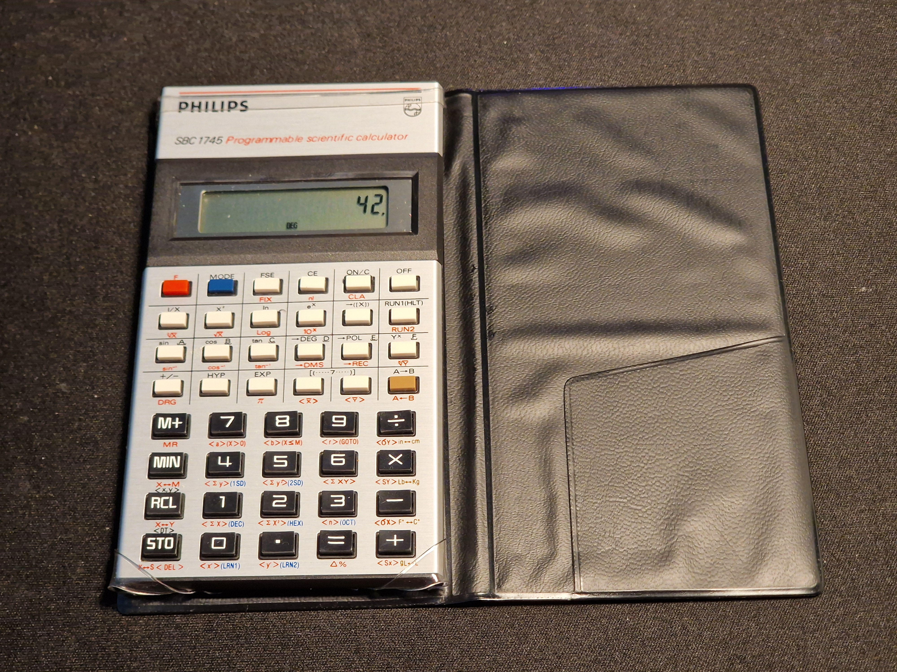

# Philips SBC 1745 Programmable Scientific Calculator

This page aims to collect resources and information about the *Philips SBC 1745
Programmable Scientific Calculator*.

> [!NOTE]  
> This page is still under construction.

## Versions

There are at least 3 versions of this calculator. Two with a black top part,
one of which lacks the red text from under the buttons (Version 1) and one that
has the text printed (Version 2), and one with a silver top part (Version 3).
I might be mixing Version 1 and Version 2 up, as it is not clear from the
sources which one came first, and the image for Version 1 and Version 2 is same
on *Calcmuseum*.

I have the Version 3, the one with the silver top part. I also have the
original case for it.

  
  
   
  

## Manual

Unfortunately, a full manual for this calculator is currently not available on
the internet.

There are full manuals available for the *Canon F-73P Scientific Calculator*
however, which works almost exactly the same way. A scan is available on the
[Internet Archive](https://archive.org/details/canon-f-73-p-instructions/page/n27/mode/2up).

## Sources

**Version 1**
  - [Calcmuseum - Philips SBC1745 (version-1)](https://www.calcuseum.com/SCRAPBOOK/BONUS/35096/1.htm)
  - [Ernst Mulder's Calculator Museum - Philips SBC 1745](https://calculator-museum.nl/calculators/philips-sbc1745-index.html)
  - [calculators.torensma.net - Philips SBC-1745](https://calculators.torensma.net/index.php?page.id=16&.id=&calculator.id=720&action=detail&#image)
  
**Version 2**
  - [Calcmuseum - Philips SBC1745 (version-2)](https://www.calcuseum.com/SCRAPBOOK/BONUS/75278/1.htm)
  - [Le Rayon des Calculatrices - Philips SBC-1745](https://le-rayon-des-calculatrices.fr/WordPress3/?p=1054)
  - [Les pas perdus... - Réparation Philips SBC 1745](http://www.emmella.fr/page4625-9550-3000-2312-4701__4954-5455-8840-1383-1205.html)
  - [Last Dodo - Philips SBC 1745](https://www.lastdodo.nl/nl/items/4808329-philips-sbc-1745-programmable-scientific-calculator)

**Version 3**
  - [Calcmuseum - Philips SBC1745 (version-3)](https://www.calcuseum.com/SCRAPBOOK/BONUS/35095/1.htm)
  - [www.calculatormuseum.nl - Philips SBC 1745](https://www.calculatormuseum.nl/calculators/philips_sbc1745.html)

**Canon F-73P Scientific Calculator**
  - [Internet Archive - User Manual Scan](https://archive.org/details/canon-f-73-p-instructions/page/n27/mode/2up)
